# Student Registration System

**Course:** ITST 302 – Client-Server Technologies  
**Module:** Week 4 – Client Requests and Form Processing  
**Repository Name:** `week04-student-registration`  
**GitHub Repository:** :contentReference[oaicite:0]{index=0}

---

# 1. Project Title

## Student Registration System with Laravel Forms, Validation, File Upload, and MySQL

---

# 2. Introduction

The **Student Registration System** is a Laravel-based web application developed for **Week 4 – Client Requests and Form Processing** in **ITST 302 – Client-Server Technologies**.

The system demonstrates how client requests, form processing, validation, file uploads, database operations, and server responses work together in a Laravel application.

Users can register students by entering their personal and academic information and uploading a profile picture. Before the information is stored, the application validates the submitted data. Valid student information is stored in a MySQL database, while profile pictures are stored using Laravel Storage.

The system also includes a Student Directory where users can view registered students, search for students, view individual student profiles, and delete student records.

The project demonstrates the practical use of:

- Laravel Routes
- Controllers
- Models
- Blade Templates
- Form Processing
- Client-Side Validation
- Server-Side Validation
- MySQL Database Integration
- Database Migrations
- File Uploads
- Laravel Storage
- Flash Success Messages
- Student Directory
- Student Profile Pages
- Delete Functionality
- Git and GitHub

The system remains focused on the requirements of the Week 4 activity while improving the organization, usability, validation, and overall interface design.

---

# 3. Objectives

The objectives of this project are to:

1. Develop a Student Registration System using Laravel.
2. Create a Student Registration Form using Blade templates.
3. Process client requests using Laravel routes and controllers.
4. Validate submitted information using Laravel server-side validation.
5. Provide client-side validation for immediate user feedback.
6. Ensure that names do not accept numbers.
7. Validate the Student ID using the format `XXXX-XXXX`.
8. Validate email addresses and prevent duplicate email registrations.
9. Ensure that mobile numbers only accept numeric input.
10. Upload and store student profile pictures using Laravel Storage.
11. Store student information in a MySQL database.
12. Display registered students in a Student Directory.
13. Display individual Student Profile pages.
14. Display validation errors when invalid information is submitted.
15. Display a flash success message after successful registration.
16. Allow registered student records to be deleted.
17. Demonstrate the Laravel request lifecycle from the browser to the database and back to the user.

---

# 4. System Features and Functionality

## 4.1 Student Directory

The main page of the application displays the Student Directory.

The directory allows users to:

- View registered students.
- View student names and profile pictures.
- View Student IDs.
- View academic programs.
- View year levels.
- Search for students.
- View individual student profiles.
- Delete student records.
- Navigate to the Student Registration Form.

---

## 4.2 Student Registration

Users can register a student by providing the following information:

- Student ID
- First Name
- Middle Name
- Last Name
- Email Address
- Mobile Number
- Date of Birth
- Gender
- Program
- Year Level
- Address
- Profile Picture

After successful validation, the student information is stored in the MySQL database.

---

## 4.3 Student ID Validation

The Student ID must follow this format:

```text
XXXX-XXXX
```

Example:

```text
1234-5678
```

The Student ID:

- Must contain exactly eight numbers.
- Must contain a dash after the first four numbers.
- Cannot contain letters.
- Cannot contain unsupported symbols.
- Must be unique.

---

## 4.4 Name Validation

The following fields are validated:

- First Name
- Middle Name
- Last Name

Numbers are not accepted in name fields.

When invalid input is entered, the system provides a validation warning and highlights the invalid field.

---

## 4.5 Email Validation

The system validates that the user enters a properly formatted email address.

The email address must also be unique.

If an invalid or duplicate email address is submitted, the system displays a validation error.

---

## 4.6 Mobile Number Validation

The Mobile Number field only accepts numeric input.

Letters are not accepted.

The system also validates the mobile number based on the required number of digits.

---

## 4.7 Profile Picture Upload

Users can upload a student profile picture.

The accepted image formats include:

- JPG
- JPEG
- PNG

The uploaded image is stored using Laravel Storage.

Profile pictures are stored in:

```text
storage/app/public/student_profiles
```

The profile picture is displayed in the Student Directory and Student Profile page.

---

## 4.8 Validation Feedback

The system provides feedback for invalid form input through:

- Red input borders.
- Validation warning messages.
- Client-side validation.
- Laravel server-side validation.

Client-side validation provides immediate feedback to the user.

Server-side validation ensures that invalid data cannot be stored in the database.

---

## 4.9 Flash Success Message

After a student is successfully registered, the system displays a flash success message.

Example:

```text
Student has been registered successfully.
```

---

## 4.10 Student Profile

Each registered student has an individual Student Profile page.

The Student Profile displays:

- Profile Picture
- Student ID
- Full Name
- Email Address
- Mobile Number
- Date of Birth
- Gender
- Program
- Year Level
- Address

---

## 4.11 Delete Student

The Student Directory allows registered student records to be deleted.

Before deletion, the system provides a confirmation prompt.

When a student is deleted:

1. The student profile picture is removed from Laravel Storage.
2. The student record is deleted from the MySQL database.
3. The user is redirected back to the Student Directory.
4. A success message is displayed.

---

# 5. Technologies Used

The following technologies were used to develop the system:

- PHP
- Laravel
- MySQL
- Blade Templates
- HTML
- CSS
- JavaScript
- Laravel Validation
- Laravel Eloquent ORM
- Laravel Migrations
- Laravel Storage
- Git
- GitHub
- Visual Studio Code
- MySQL Workbench

---

# 6. Development Environment

The project was developed using the following environment:

| Software / Technology | Version / Usage |
|---|---|
| Operating System | Windows |
| PHP | 8.4.20 |
| Laravel | 13.29.0 |
| Database | MySQL |
| IDE | Visual Studio Code |
| Version Control | Git |
| Repository Hosting | GitHub |
| Database Tool | MySQL Workbench |

---

# 7. Database Configuration

The application uses MySQL.

The database used for the project is:

```text
student_registration_db
```

The database can be created using:

```sql
CREATE DATABASE student_registration_db;
```

The Laravel `.env` file should contain the appropriate MySQL configuration.

Example:

```env
DB_CONNECTION=mysql
DB_HOST=127.0.0.1
DB_PORT=3306
DB_DATABASE=student_registration_db
DB_USERNAME=root
DB_PASSWORD=
```

The `DB_USERNAME` and `DB_PASSWORD` may vary depending on the local MySQL configuration.

---

# 8. Database Structure

The main table used by the Student Registration System is:

```text
students
```

The table contains the following fields:

| Field | Description |
|---|---|
| `id` | Primary key |
| `student_id` | Unique student identification number |
| `first_name` | Student's first name |
| `middle_name` | Student's middle name |
| `last_name` | Student's last name |
| `email` | Unique student email address |
| `mobile_number` | Student's mobile number |
| `date_of_birth` | Student's date of birth |
| `gender` | Student's gender |
| `program` | Student's academic program |
| `year_level` | Student's current year level |
| `address` | Student's address |
| `profile_picture` | Path to the uploaded profile picture |
| `created_at` | Record creation timestamp |
| `updated_at` | Record update timestamp |

The database structure directly corresponds to the Student model, migration, registration form, controller validation, Student Directory, and Student Profile page.

---

# 9. Laravel Implementation

## 9.1 Routes

The application routes are defined in:

```text
routes/web.php
```

The routes handle the following actions:

- Display Student Directory
- Display Student Registration Form
- Store Student Information
- Display Student Profile
- Delete Student

The route flow includes:

```text
GET     /                   Student Directory
GET     /students/create    Student Registration Form
POST    /students           Store Student
GET     /students/{student} Student Profile
DELETE  /students/{student} Delete Student
```

---

## 9.2 Controller

The application uses:

```text
app/Http/Controllers/StudentController.php
```

The controller contains the following methods:

```text
index()
create()
store()
show()
destroy()
```

### `index()`

Retrieves registered students and displays the Student Directory.

### `create()`

Displays the Student Registration Form.

### `store()`

Validates submitted information, uploads the profile picture, and stores the student record in MySQL.

### `show()`

Displays the information of an individual student.

### `destroy()`

Deletes the selected student record and removes the associated profile picture from Laravel Storage.

---

## 9.3 Model

The Student model is located at:

```text
app/Models/Student.php
```

The model represents the `students` table.

The model uses `$fillable` to allow the required student information to be stored.

The `date_of_birth` field is cast as a date so that it can be properly formatted in the Student Profile page.

---

## 9.4 Blade Views

The main Blade templates are located in:

```text
resources/views/
```

Important views include:

```text
layouts/app.blade.php
students/index.blade.php
students/create.blade.php
students/show.blade.php
```

### `index.blade.php`

Displays the Student Directory.

### `create.blade.php`

Displays the Student Registration Form and validation feedback.

### `show.blade.php`

Displays the registered student's profile.

### `app.blade.php`

Provides the shared application layout.

---

# 10. Form Validation

The application uses both client-side and server-side validation.

## Student ID

Required format:

```text
XXXX-XXXX
```

Example:

```text
1234-5678
```

Validation includes:

- Four numbers before the dash.
- Four numbers after the dash.
- A required dash between the numbers.
- Unique Student ID validation.

---

## Names

The First Name and Last Name fields are required.

The Middle Name field may be optional depending on the form implementation.

Name fields are validated to prevent numbers from being entered.

---

## Email

The Email field:

- Is required.
- Must contain a valid email address.
- Must be unique.

---

## Mobile Number

The Mobile Number:

- Is required.
- Only accepts numbers.
- Is validated according to the required number of digits.

---

## Date of Birth

The Date of Birth:

- Is required.
- Must contain a valid date.
- Must be before the current date.

---

## Gender

The selected gender must be one of the available options:

```text
Male
Female
Other
```

---

## Profile Picture

The Profile Picture:

- Is required.
- Must be a valid image.
- Accepts JPG, JPEG, and PNG formats.
- Has a maximum upload size based on the configured Laravel validation rule.

---

# 11. Installation and Setup Instructions

## Step 1: Clone the Repository

Clone the project repository:

```bash
git clone https://github.com/marubalmes/week04-student-registration.git
```

Navigate to the project folder:

```bash
cd week04-student-registration
```

---

## Step 2: Install PHP Dependencies

Run:

```bash
composer install
```

---

## Step 3: Create the Environment File

Copy the example environment file:

```bash
copy .env.example .env
```

Generate the Laravel application key:

```bash
php artisan key:generate
```

---

## Step 4: Configure the Database

Create the MySQL database:

```sql
CREATE DATABASE student_registration_db;
```

Update the `.env` file:

```env
DB_CONNECTION=mysql
DB_HOST=127.0.0.1
DB_PORT=3306
DB_DATABASE=student_registration_db
DB_USERNAME=root
DB_PASSWORD=
```

Update the username and password if your MySQL configuration is different.

---

## Step 5: Run Database Migrations

Run:

```bash
php artisan migrate
```

This creates the required database tables.

---

## Step 6: Create the Storage Link

Run:

```bash
php artisan storage:link
```

This allows uploaded student profile pictures stored in Laravel Storage to be accessed through the browser.

---

## Step 7: Install Front-End Dependencies

Run:

```bash
npm install
```

Start the front-end development server:

```bash
npm run dev
```

---

## Step 8: Start Laravel

Open another terminal and run:

```bash
php artisan serve
```

Open the application in a browser:

```text
http://127.0.0.1:8000
```

---

# 12. Project Structure

```text
week04-student-registration/
│
├── app/
│   ├── Http/
│   │   └── Controllers/
│   │       └── StudentController.php
│   │
│   └── Models/
│       └── Student.php
│
├── database/
│   └── migrations/
│       └── create_students_table.php
│
├── documentation/
│   ├── student-registration-flowchart.png
│   ├── student-registration-erd.png
│   └── laravel-request-lifecycle.png
│
├── public/
│
├── resources/
│   └── views/
│       ├── layouts/
│       │   └── app.blade.php
│       │
│       └── students/
│           ├── index.blade.php
│           ├── create.blade.php
│           └── show.blade.php
│
├── routes/
│   └── web.php
│
├── screenshots/
│   ├── 01-registration-form.png
│   ├── 02-validation-errors.png
│   ├── 03-successful-registration.png
│   ├── 04-flash-success-message.png
│   ├── 05-uploaded-profile-picture.png
│   ├── 06-student-profile-page.png
│   ├── 07-student-directory.png
│   ├── 08-database-records.png
│   ├── 09-vscode-project-structure.png
│   ├── 10-github-repository.png
│   ├── 11-terminal-output.png
│   └── 12-browser-output.png
│
├── .env.example
├── .gitignore
├── artisan
├── composer.json
├── package.json
└── README.md
```

---

# 13. System Flow

The general Student Registration System flow is:

```text
User / Browser
        │
        ▼
Student Directory
        │
        ▼
Click "Register Student"
        │
        ▼
Student Registration Form
        │
        ▼
Enter Student Information
        │
        ▼
Client-Side Validation
        │
        ▼
Submit Form
        │
        ▼
Laravel Route
        │
        ▼
StudentController
        │
        ▼
Server-Side Validation
        │
        ├──────────── Invalid ────────────┐
        │                                 │
        ▼                                 ▼
      Valid                       Display Validation Errors
        │                                 │
        ▼                                 │
Upload Profile Picture ◄───────────────────┘
        │
        ▼
Laravel Storage
        │
        ▼
Student Model
        │
        ▼
MySQL Database
        │
        ▼
Student Record Saved
        │
        ▼
Flash Success Message
        │
        ▼
Student Profile Page
```

---

# 14. Required Documentation Diagrams

The following diagrams are included in the `documentation/` folder.

## 14.1 Student Registration Process Flowchart

File:

```text
documentation/student-registration-flowchart.png
```

This diagram illustrates the registration process from opening the system to validating the form, uploading the profile picture, storing the student information, and displaying the Student Profile.

---

## 14.2 Student Registration System ER Diagram

File:

```text
documentation/student-registration-erd.png
```

The ER Diagram represents the actual MySQL database structure used by the system.

The main application table is:

```text
students
```

The diagram includes the actual fields used by the Laravel migration, Student model, and registration system.

---

## 14.3 Laravel Request Lifecycle Diagram

File:

```text
documentation/laravel-request-lifecycle.png
```

The diagram illustrates the Laravel request flow:

```text
Browser
   ↓
routes/web.php
   ↓
StudentController
   ↓
Validation
   ↓
Student Model
   ↓
MySQL Database
   ↓
Blade Views
   ↓
HTML Response
   ↓
Browser
```

The lifecycle diagram may also include the profile picture upload process through Laravel Storage.

---

# 15. Screenshots

The following screenshots demonstrate the functionality of the completed Student Registration System.

## 15.1 Registration Form

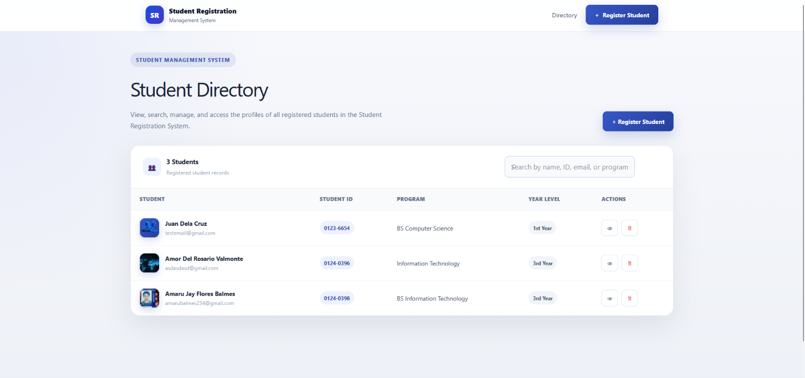

The Student Registration Form allows users to enter student information and upload a profile picture.

---

## 15.2 Validation Errors

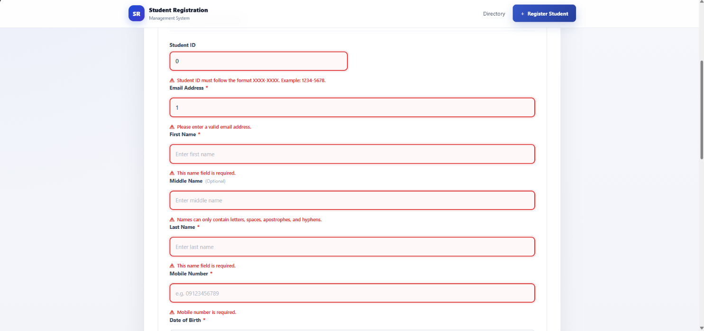

The system displays validation warnings when invalid information is entered.

Examples include:

- Invalid Student ID format.
- Numbers entered in name fields.
- Invalid email address.
- Invalid mobile number.
- Missing required information.

---

## 15.3 Successful Registration

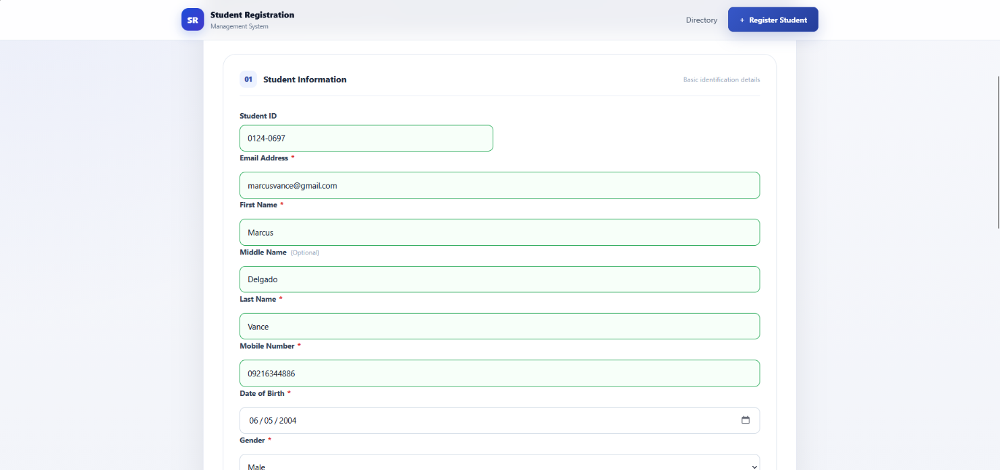

This screenshot demonstrates a successful student registration.

---

## 15.4 Flash Success Message

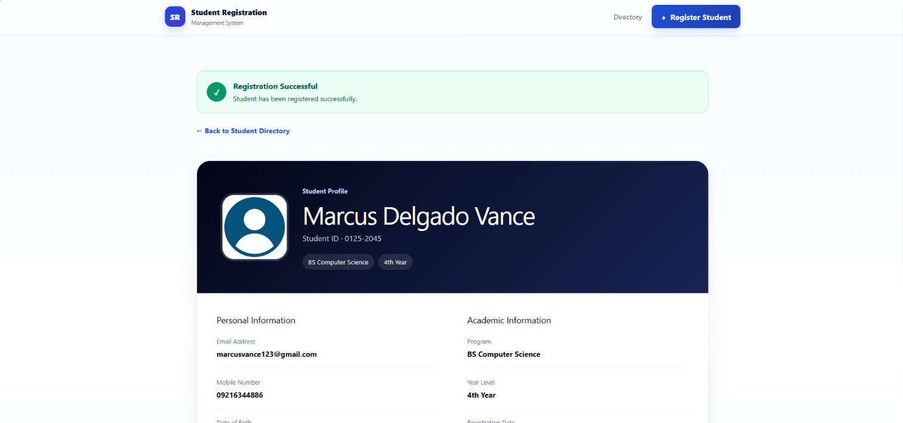

A success message is displayed after a student record is successfully registered.

---

## 15.5 Uploaded Profile Picture

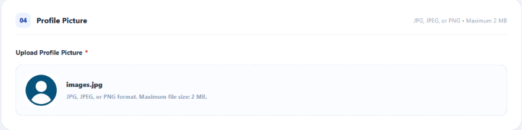

The uploaded student profile picture is displayed within the system.

---

## 15.6 Student Profile Page

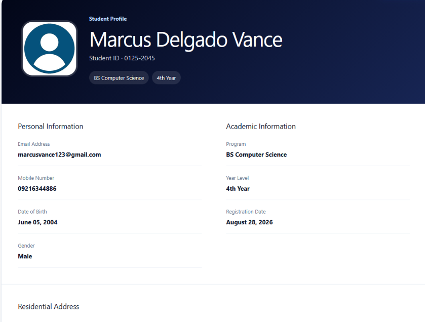

The Student Profile page displays the complete information of a registered student.

---

## 15.7 Student Directory

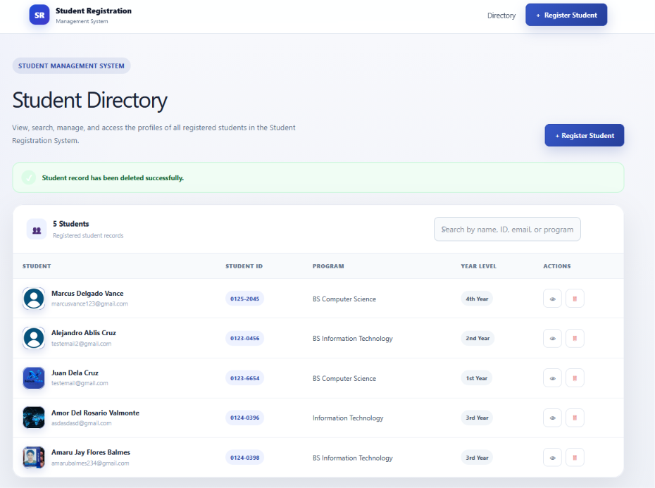

The Student Directory displays registered students and provides search, profile viewing, and deletion functionality.

---

## 15.8 Database Records

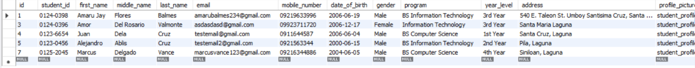

This screenshot shows student records stored in the MySQL `students` table.

---

## 15.9 VS Code Project Structure

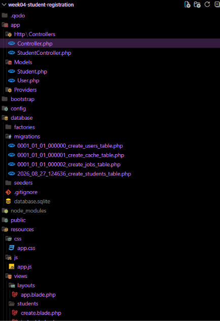

This screenshot displays the important Laravel project files and folders.

---

## 15.10 GitHub Repository

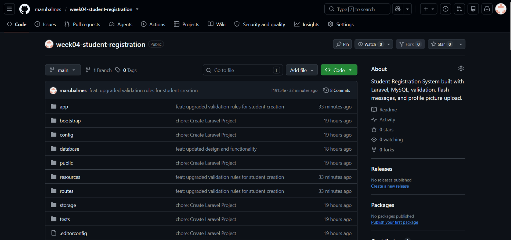

This screenshot shows the GitHub repository containing the complete project.

Repository:

:contentReference[oaicite:1]{index=1}

---

## 15.11 Terminal Output

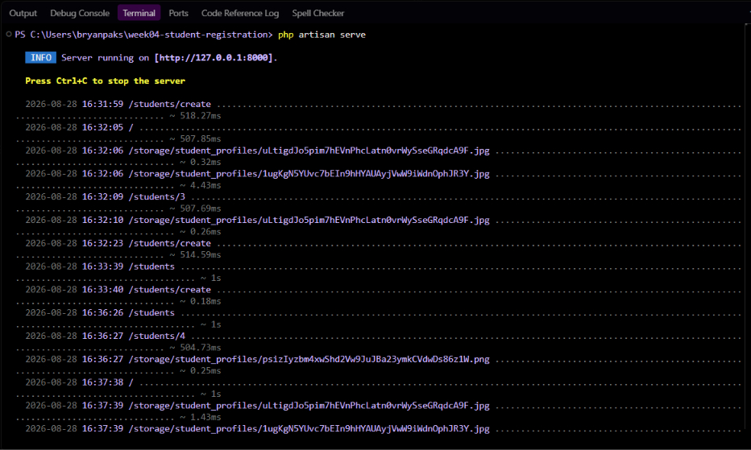

This screenshot demonstrates the Laravel application running successfully through the terminal.

---

## 15.12 Browser Output

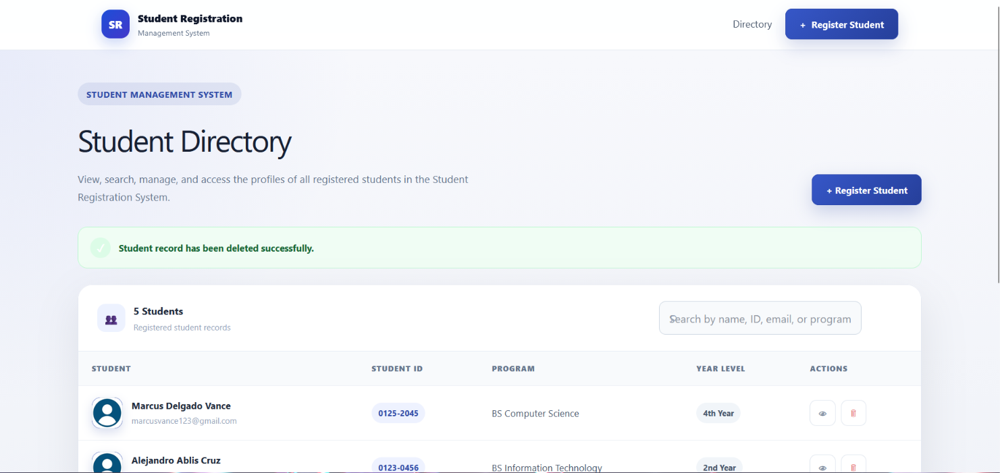

This screenshot demonstrates the completed Student Registration System running successfully in the browser.

---

# 16. Problems Encountered and Solutions

## Problem 1: Database Session Table Error

### Problem

The application initially produced an error because Laravel attempted to access a `sessions` table that did not exist in the MySQL database.

### Solution

The required database migrations were executed to create the necessary database tables.

---

## Problem 2: View Not Found

### Problem

Laravel displayed the following error:

```text
View [students.index] not found.
```

### Solution

The required Blade view file was created in:

```text
resources/views/students/index.blade.php
```

The view name was matched correctly with the controller:

```php
return view('students.index', compact('students'));
```

---

## Problem 3: Date Formatting Error

### Problem

The Student Profile page produced the following error:

```text
Call to a member function format() on string
```

This occurred because `date_of_birth` was returned as a string instead of a date object.

### Solution

The Student model was updated to cast the field as a date:

```php
protected function casts(): array
{
    return [
        'date_of_birth' => 'date',
    ];
}
```

This allowed the date to be formatted properly in the Blade view.

---

## Problem 4: Profile Picture Storage

### Problem

Uploaded images require a public storage link before they can be accessed through the browser.

### Solution

The following command was executed:

```bash
php artisan storage:link
```

This creates the symbolic link required for Laravel Storage.

---

## Problem 5: Student Input Validation

### Problem

The initial validation did not fully prevent invalid input such as numbers in names or incorrect Student ID formatting.

### Solution

The system was updated with both:

- Client-side validation.
- Laravel server-side validation.

The Student ID was configured to follow:

```text
XXXX-XXXX
```

Name fields reject numbers, while the mobile number field only accepts numeric input.

---

# 17. Git and GitHub

The project is maintained using Git and GitHub.

**Repository Name:**

```text
week04-student-registration
```

**Repository URL:**

:contentReference[oaicite:2]{index=2}

**Clone URL:**

```bash
git clone https://github.com/marubalmes/week04-student-registration.git
```

The repository contains:

- Laravel source code.
- README.md.
- Screenshots.
- Documentation diagrams.
- Database migration files.
- Student model.
- Student controller.
- Blade views.
- Routes.
- Meaningful Git commits.

Examples of meaningful commit messages include:

```text
chore: initialize Laravel project
feat: create student migration and model
feat: add student registration routes
feat: implement StudentController
feat: add server-side validation
feat: add client-side form validation
feat: implement profile picture upload
feat: create student directory
feat: add student profile page
feat: add student delete functionality
docs: add project diagrams
docs: add system screenshots
docs: complete README documentation
```

---

# 18. Learning Reflection

Developing the Student Registration System helped me better understand how client requests and form processing work in a Laravel application. This activity allowed me to see how Laravel routes, controllers, models, Blade templates, validation, databases, and file storage work together in an actual web application.

One of the most important things I learned was how a request travels through Laravel. When a user interacts with the Student Registration System, the request begins in the browser and is handled by a route defined in `web.php`. The route sends the request to the appropriate method inside the `StudentController`. The controller processes the request, validates the submitted information, handles the profile picture upload, communicates with the Student model, and stores the information in the MySQL database. Laravel then returns the appropriate Blade view to the user.

I also learned the importance of using both client-side and server-side validation. Client-side validation improves the user experience by immediately informing users when their input is invalid. Server-side validation is important because it ensures that invalid data cannot be stored in the database. In this project, the Student ID follows the `XXXX-XXXX` format, names do not accept numbers, email addresses must be valid and unique, and mobile numbers only accept numeric input.

Another important part of the project was learning how file uploads work in Laravel. I learned how to validate image files, store them using Laravel Storage, create a storage link, and display uploaded profile pictures in the application.

The project also helped me understand database migrations and the relationship between the Laravel model and the MySQL database. The `students` table was designed to contain the information required by the Student Registration Form. Using the Student model and Laravel's Eloquent ORM made it easier to store, retrieve, display, and delete student records.

During development, I encountered several problems, including database table issues, missing Blade views, validation problems, and date formatting errors. Troubleshooting these problems helped me understand the importance of reading error messages, identifying the cause of a problem, and applying the correct solution.

Overall, this activity improved my understanding of Laravel client-server communication and form processing. It gave me practical experience in developing a complete Laravel-based Student Registration System while applying the concepts required in Week 4 – Client Requests and Form Processing.

---

# 19. Conclusion

The Student Registration System successfully demonstrates the concepts covered in Week 4 – Client Requests and Form Processing.

The application allows users to:

- Register students.
- Validate submitted information.
- Upload profile pictures.
- Store data in MySQL.
- Display registered students.
- Search the Student Directory.
- View individual student profiles.
- Display validation errors.
- Display flash success messages.
- Delete student records.

The project demonstrates the following Laravel workflow:

```text
Browser
    ↓
Route
    ↓
Controller
    ↓
Validation
    ↓
Model
    ↓
MySQL Database
    ↓
Blade View
    ↓
Browser
```

The completed system remains focused on the Student Registration functionality required for the activity while applying improved organization, validation, usability, and interface design.

---

# 20. References

Laravel. *Laravel Documentation*.  
:contentReference[oaicite:3]{index=3}

PHP. *PHP Documentation*.  
:contentReference[oaicite:4]{index=4}

MySQL. *MySQL Documentation*.  
:contentReference[oaicite:5]{index=5}

GitHub. *GitHub Documentation*.  
:contentReference[oaicite:6]{index=6}

---

# Author

**Balmes, Amaru Jay F.**

Bachelor of Science in Information Technology

**Course:** ITST 302 – Client-Server Technologies  
**Module:** Week 4 – Client Requests and Form Processing